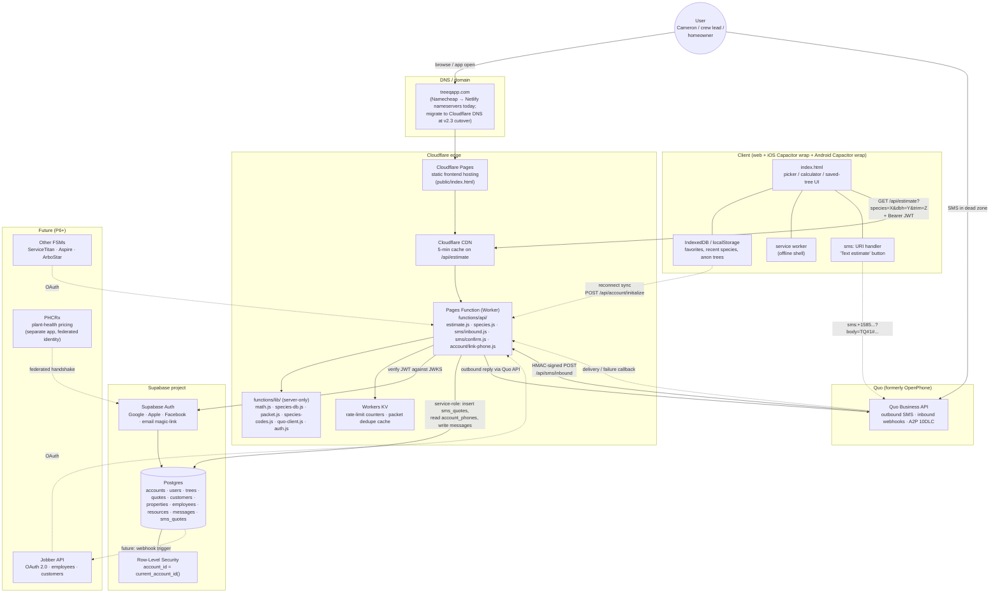

# R10 — System Architecture (Target)

> Synthesis of R2 (server), R5 (auth), R7 (pricing extraction), R8 (data) and the SMS-fallback flow from `SMS_FALLBACK_SPEC.md`. One diagram of the full target system after the parked v2.3 stack is activated and Supabase Auth + DB are wired in.
> Prepared 2026-05-10 overnight session #2.

This is the **end state** the ROADMAP P3 → P7 phases are aimed at. Today (v1.9) the diagram is much simpler: client at Netlify ↔ user. R10 is what we're building toward, not what we have.

---

## Architecture diagram

---

## Annotations (link-by-link)

### Client → DNS → Pages

- **Browser/Capacitor** loads `treeqapp.com`. DNS today is Namecheap → Netlify nameservers (per CONTEXT.md). The v2.3 cutover (Option A from R2) migrates DNS to Cloudflare. Nameserver swap is a one-time event with a short TTL window.
- **Cloudflare Pages** serves the static frontend (`index.html` + assets). Auto-deploys on push to the `deploy/` branch.

### Client ↔ CDN ↔ Worker (the read path)

- **`/api/estimate`** is the load-bearing read endpoint. CDN caches identical inputs for 5 minutes (per `deploy/functions/api/estimate.js:39`). Cache miss → Worker runs `compute()` from `functions/lib/math.js` using `species-db.js` coefficients.
- **Auth header** carries Supabase JWT (signed-in users) or `Bearer anon-<sessionToken>` (anon users, with stricter rate limit per R7 §1).
- **Rate limit** at Worker step uses Workers KV counters per the SMS spec §7 limit table; same KV doubles for SMS-fallback abuse counters.
- **The math is never on the client.** This is the entire IP-protection story.

### Client → Quo → Worker (the SMS-fallback path)

- **`sms:` URI** opens the user's Messages app pre-filled with the TQ packet. iOS Safari + Android Chrome both support this. iPad-Wi-Fi-only users see a dead button (per spec §9).
- **Quo Business API** delivers the inbound SMS to its own infrastructure, then POSTs an HMAC-signed webhook to `/api/sms/inbound`. We verify the HMAC in `quo-client.js` before any other processing.
- **Outbound reply** uses the Quo outbound SMS endpoint via `quo-client.js`. A2P 10DLC inheritance from Cameron's existing brand reg is the open spec question (R6).

### Worker → Supabase

- **JWT verification** against Supabase Auth's JWKS endpoint. Cached at the edge; sub-millisecond after first lookup.
- **Service-role inserts** into Postgres for SMS-fallback rows (`sms_quotes`, `messages`). RLS doesn't cover these because they're written before the user is identified.
- **User-role queries** for the live picker/calculator / save-tree flows go through the Supabase JS client with the user's JWT, so RLS filters everything by `account_id`.

### Reconnect / sync

- When the device comes back online (`window.addEventListener('online', ...)`), the client checks IndexedDB for pending packet records and `POSTs` `/api/account/initialize` (or `/api/sms/quotes?since=...`) to pull server-side history into the device.

### Future links (dotted)

- **Jobber API** (P6): OAuth 2.0 in, employees + customers out. Webhook listener on the Worker; rows land in `employees` and `customers` tables.
- **Other FSMs** (P8): same shape; build the F6 sync as a generic adapter so each new FSM is configuration not new code.
- **PHCRx** (P9): your friend's plant-health app. Either a federated identity handshake (shared Supabase project? OAuth between projects?) or a one-way handoff URL with a signed customer-and-property payload. Out of scope for R10; flagged here so the diagram acknowledges the planned link.

---

## What lives where

| Concern | Layer | Why |
|---|---|---|
| UI strings, picker tiles, leaf decision tree | Client | Public knowledge; no IP value |
| Species names + group labels | Client (and `species` table for future) | Public botanical info |
| Calibration coefficients (`b0`, `b1`, `sg`, …) | Worker `functions/lib/species-db.js` | **Trade secret. Never on client.** |
| Math engine `compute()` and helpers | Worker `functions/lib/math.js` | **Trade secret. Never on client.** |
| `BRUSH_SEC_PER_CUT`, `LOG_SEC_PER_CUT`, `BRUSH_DIAM_DIST`, `ABSORB_PROFILES` | Worker `species-db.js` | Trade secret. |
| Per-account data: trees, quotes, employees, customers | Postgres | Per-tenant; RLS-protected |
| Auth identity | Supabase Auth | Managed identity; JWTs signed by Supabase |
| Rate-limit counters + packet dedupe cache | Workers KV | Edge-local, low-latency, time-windowed |
| SMS conversation log | Postgres `messages` | Long-term storage + customer thread |
| Local favorites, recent species | localStorage / IndexedDB | Anon mode + offline shell |

---

## What changes vs today

Today (v1.9 / `index.html` on Netlify):
- Single static file. All math + species DB inline. Client-side everything.
- No auth.
- No DB.
- No SMS.
- No `/api/*`.

Target (this diagram):
- Static frontend on Cloudflare Pages. Inline math removed.
- `/api/estimate` is canonical pricing. CDN-cached.
- Supabase Auth for identity. Postgres for per-account state. RLS for tenancy.
- SMS-fallback path live via Quo Business API.
- Workers KV for rate limits + dedupe.

The migration is staged across ROADMAP phases P2 (auth) → P3 (saved trees) → P4 (resources) → P5 (team) → P6 (Jobber) → P7 (pricing engine v1) plus the SMS-1 → SMS-7 series interleaved.

---

## Risks / things to watch

1. **DNS cutover from Netlify to Cloudflare.** One-time pain. Plan a low-traffic-window swap (overnight) and lower TTLs ahead of time. Keep Netlify warm for a 48-hour rollback window.
2. **CF Access vs anon users.** Per R7 §"What about Cloudflare Access?", prod can't use CF Access if anon users + Quo webhooks need access. Use Supabase JWT instead, keep CF Access only on staging URLs.
3. **Capacitor + Supabase OAuth PKCE issues.** R5 §5 covers; budget time for the integration sharp edges.
4. **Quo A2P 10DLC inheritance.** R6 needs to confirm that Cameron's existing brand registration covers programmatic outbound; if not, separate registration adds days/weeks of compliance lead time.
5. **`species-db.js` updates require a Worker redeploy.** Acceptable since calibration changes are rare. If it gets frequent, consider moving coefficient deltas to a Postgres table that the worker reads on cold start (with cache).
6. **Failure of any one Cloudflare service** (Pages, Workers, KV) breaks the live calculator. SMS-fallback is the partial mitigation. Quo provider outage breaks SMS but not the live calculator. Fully independent failures = good operational separation.

---

## Sources / cross-references

- R1 — doc inventory (frames every input)
- R2 — server architecture comparison (recommends Option A — what this diagram assumes)
- R5 — auth architecture (Supabase JWT, RLS, anon mode, Capacitor pitfalls)
- R7 — pricing extraction plan (the Worker-as-pricing-source story)
- R8 — data architecture (every table referenced in the Postgres node)
- `SMS_FALLBACK_SPEC.md` — packet format, rate limits, account-to-phone linking
- `CONTEXT.md` — current state (Netlify + single-file)
- `deploy/DEPLOY.md` — parked v2.3 deploy steps
- R3 (forthcoming) — Capacitor wrap mechanics
- R6 (forthcoming) — Quo API surface
- R4 (forthcoming) — store enrollment for the Capacitor builds
