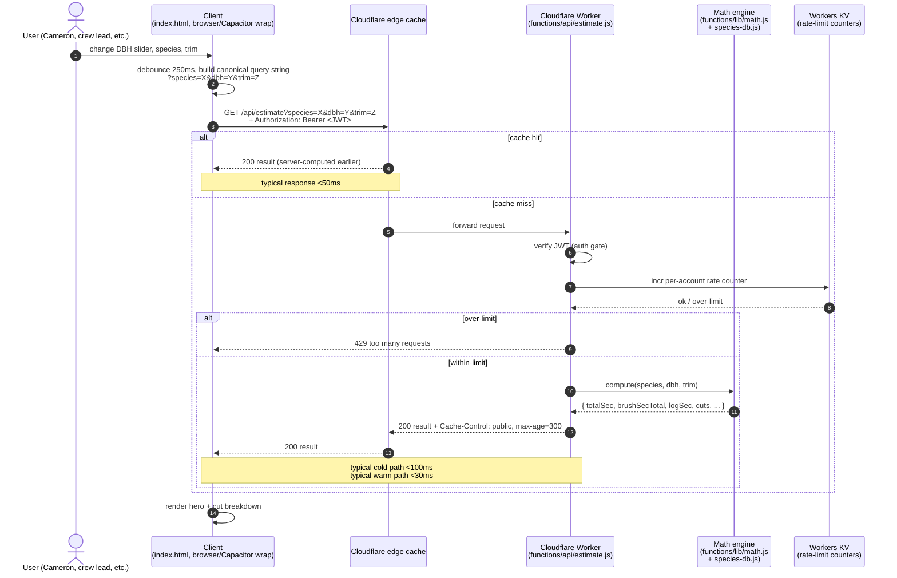

# R7 — Pricing Engine Extraction Plan

> Move `compute()` and the `SPECIES` coefficients off the client and behind an authenticated server endpoint, while keeping the live calculator UX responsive.
>
> The math layer is already extracted in `deploy/functions/lib/math.js` and `deploy/functions/lib/species-db.js`; the `deploy/` stack is parked. This R-doc proposes the migration plan that turns "parked" into "shipped."
> Prepared 2026-05-10 overnight session #2.

---

## TL;DR

The right shape isn't "every input change does a network round-trip." It's:

1. Client-side **`compute()` is *removed*** entirely from production `index.html`.
2. The server becomes the single source of truth for pricing. `GET /api/estimate?species=X&dbh=Y&trim=Z` returns a full result.
3. **Live calculator responsiveness** is preserved by debouncing input changes (200–300ms) and by the server's HTTP caching of pure-function results (`Cache-Control: public, max-age=300` is already set in `deploy/functions/api/estimate.js:39`). Re-typing the same inputs hits the CDN, not the worker.
4. **Offline-first**: when offline (`navigator.onLine === false`), the SMS-fallback button (already speced) is the path. **No client-side pricing fallback** — that would defeat the IP-protection purpose.
5. **Auth gate**: per memory, the methodology is the moat. The estimate endpoint is gated by Supabase JWT (or Cloudflare Access for the unauthenticated parked-deploy scenario). Anon users still get pricing — but only via the rate-limited server, never with the math living on their device.
6. **Rollback / kill-switch**: a feature flag (`window.__TREEQ_USE_SERVER_PRICING__ = true`) controls the swap. Reverting to the v1.9 inline-pricing flow is a one-line config change. Keep this flag for the first 30 days post-cutover.

The whole migration is **6 steps** below. Net new code is small because the server-side files already exist.

---

## Sequence diagram (server round-trip)



Key properties:

- **Debounce in step 2** absorbs slider-drag input bursts.
- **CDN cache (step 5a)** absorbs same-input repeats. Pure function → safe to cache aggressively. The 5-minute window is already set in the existing `estimate.js`.
- **Rate limit (step 7)** lives in Workers KV; per spec §7 of SMS_FALLBACK, 60/hr per account. Same KV doubles as the SMS abuse counter.
- **Auth verify (step 6)** is a single `verifyJwt()` call against Supabase JWKS — sub-millisecond after first cache.

---

## Step 1 — Server: ship the pricing endpoint as-is, behind auth

**File:** `deploy/functions/api/estimate.js` (already exists; 41 LOC).

Add JWT verification before the compute call. Sample additions only — don't apply during research mode:

```js
import { verifyJwt } from '../lib/auth.js'; // new helper, calls Supabase JWKS

export async function onRequestGet({ request, env }) {
  const auth = await verifyJwt(request, env);
  if (!auth.ok) return new Response('unauthorized', { status: 401 });
  // ... existing parsing + compute ...
}
```

**For anon users**: in MVP, allow `Bearer anon-<sessionToken>` issued by the client at first load with a tight per-IP rate limit (5 req/min). Anon access is necessary for the picker to work without sign-in (per R5 §4 Option 1).

**Verification:** existing local `npm run dev` from `deploy/` works end-to-end with curl `http://localhost:8788/api/estimate?species=silver_maple&dbh=18&trim=0`.

**Deliverable:** `/api/estimate` returns identical numbers to current client-side `compute()` for all 56 species × DBH 6–48 × trim 0–4. (See Step 5 for the diff harness.)

## Step 2 — Client: feature flag the swap

Top of `index.html` script tag:

```js
const USE_SERVER_PRICING = false; // flip to true once Step 1 is live
```

Every call site of `compute()` (currently 1 in `render()` plus 1 import via `computeFlag`) gets wrapped:

```js
async function getEstimate(speciesKey, dbh, trimPct) {
  if (!USE_SERVER_PRICING) return compute(speciesKey, dbh, trimPct);
  const url = `/api/estimate?species=${speciesKey}&dbh=${dbh}&trim=${trimPct}`;
  const res = await fetch(url, { headers: { 'Authorization': `Bearer ${getToken()}` } });
  if (!res.ok) throw new Error('estimate failed: ' + res.status);
  return res.json();
}
```

`render()` becomes async. All call sites already exist (line 2196 `function render()`).

**Important:** the flag stays *off* in production until Step 5 confirms math parity. Cameron flips it manually after he's seen identical numbers come back from the server for his own test cases.

## Step 3 — Debounce + cache discipline

**Debounce** input changes (slider drag, stepper button-mash) so we don't flood the worker:

```js
let renderTimer;
function scheduleRender() {
  clearTimeout(renderTimer);
  renderTimer = setTimeout(render, 250);
}
```

Replace direct `render()` calls in input handlers (currently ~15 sites, lines 2273–2399) with `scheduleRender()` once `USE_SERVER_PRICING` is true. Leave the synchronous-render path alone for the local-pricing fallback so feature-flag-off behaves identically to today.

**Server-side cache:** existing `Cache-Control: public, max-age=300` in `estimate.js:39` is correct. With the canonical query string, identical inputs hit the CDN.

**Client-side cache** (small in-memory LRU, optional but useful):

```js
const _estimateCache = new Map();
async function getEstimate(speciesKey, dbh, trimPct) {
  const key = `${speciesKey}|${dbh}|${trimPct}`;
  if (_estimateCache.has(key)) return _estimateCache.get(key);
  // ... fetch ...
  _estimateCache.set(key, json);
  if (_estimateCache.size > 100) _estimateCache.delete(_estimateCache.keys().next().value);
  return json;
}
```

This makes slider-drag → server traffic essentially zero after the first fetch in a session.

## Step 4 — Rollback / kill-switch

Two layers:

1. **Per-deploy flag.** `USE_SERVER_PRICING = false` reverts the whole app to the v1.9 inline-pricing flow with a single boolean change. Keep this flag in for at least 30 days post-cutover. After that, when the flag has been `true` long enough that Cameron is confident, remove the inline `compute()` and `SPECIES` from `index.html` — that's the "cutover" event.
2. **Server-down-graceful-degradation.** When `getEstimate()` throws (timeout, 500, network), show the user a small banner "Estimator offline — try the SMS fallback." Do **not** silently fall back to client-side compute. The methodology-protection memory means the math must not be in the client even on degraded paths.

**Important non-feature:** there is no "private cache of the math" that the client can use offline. That would be a backdoor around the IP boundary. If the server is down and the user is online, they get an error. If they're offline, they get the SMS-fallback button.

## Step 5 — Math regression harness (the load-bearing step)

Before flipping the flag, run a diff harness across the full input space:

```js
// tests/T-server-parity.mjs
import { chromium } from 'playwright';
import { compute as clientCompute } from '../index.html /* via page.evaluate */';

const speciesKeys = [...]; // 56 from production
const dbhs = [6, 8, 10, 12, ..., 48]; // 22 values
const trims = [0, 1, 2, 3, 4];
// Total: 56 × 22 × 5 = 6160 cases

for (const sp of speciesKeys) {
  for (const dbh of dbhs) {
    for (const trim of trims) {
      const a = clientCompute(sp, dbh, trim);
      const b = await fetch(`/api/estimate?species=${sp}&dbh=${dbh}&trim=${trim}`).then(r => r.json());
      assertEqual(a.totalSec, b.totalSec, 0.001);
      // ... and all other fields ...
    }
  }
}
```

**Tolerance: zero divergence.** The server runs the exact same math; any diff = bug.

If the harness passes 6160/6160, flip the flag. If even one case fails, fix and re-run before flipping.

This harness lives in `tests/` (per HANDOFF rules — all test artifacts go in `tests/`).

## Step 6 — Dev-time fast path

Hot-reload during development of `index.html` should not require redeploying the Worker. Solutions:

1. **Local mode (recommended).** Run `cd deploy && npm run dev` (wrangler pages dev). It proxies the static files in `deploy/public/` and serves the Worker for `/api/*`. Edit `index.html` → reload browser. Edit Worker → wrangler hot-reloads.
2. **Two-server dev mode.** If Cameron prefers editing `index.html` from project root: serve project root via `npx serve` on port 3000, run wrangler on 8788, set `WORKER_BASE = 'http://localhost:8788'` in dev, and CORS-allow it. Slightly more setup but lets the production-shape `index.html` keep living at project root.

**Recommend mode 1.** It mirrors production CDN-shape exactly. The single-file `index.html` can be symlinked or copied into `deploy/public/` during the cutover; the file is small (~115 KB) and copying-on-deploy is fine.

---

## Step ordering recap

| # | Step | Owner / scope | Risk | Reversible? |
|---|---|---|---|---|
| 1 | Ship `/api/estimate` behind auth | Server (deploy/) | low | yes — endpoint is additive |
| 2 | Add `USE_SERVER_PRICING` flag + `getEstimate()` wrapper | Client (index.html) | low | yes — flag is off |
| 3 | Add debounce + client cache | Client | low | yes — only active when flag on |
| 4 | Implement graceful-degradation banner | Client | low | yes — only active when flag on |
| 5 | Math regression harness — must pass 100% | Tests | medium | n/a (test, not behavior change) |
| 6 | Set up dev-mode hot reload | Tooling | low | n/a (dev only) |
| **F1** | **Flip flag in prod, monitor 7 days** | Cameron | medium | yes — flip back |
| **F2** | **Delete inline `compute()` + `SPECIES` from `index.html`** | Client | high | reverse-able from git but moot once shipped |

F1 and F2 are explicitly **separate events**. Don't bundle them. F2 is the "no going back" cutover and only happens once F1 has been clean for at least a week.

---

## What about Cloudflare Access?

`deploy/DEPLOY.md` describes a Cloudflare Access gate on the entire URL. That works for the parked v2.3 single-tenant scenario, but **it doesn't work once we have anon users and SMS-fallback inbound webhooks** (Quo can't authenticate against Access). Two options:

- **Drop CF Access for the prod deploy.** Use Supabase JWT instead, per Step 1. Keep CF Access for staging/dev URLs only.
- **Use CF Access for the static frontend, but expose `/api/sms/inbound` as a public endpoint with HMAC verification.** Same security posture but more setup.

Recommendation: drop CF Access for prod, gate via Supabase JWT. That fits the multi-user-per-account roadmap better than IP-allowlist Access.

---

## What stays client-side after extraction

- The picker UI (genus tiles, species rows, decision tree).
- The species *names* and *group categories* (public knowledge — present in `SPECIES_DATA` for picker rendering).
- The leaf decision tree's question/answer strings.
- The 5-bucket trim segmented control.
- Everything in `:root` CSS, all hand-coded styling.

What goes server-only:

- The full coefficient table for all 56 species (`b0`, `b1`, `sg`, `moisture`, `brushFrac`, `foliageFrac`, `heightA/B`, `crownIntercept/Slope`, `diamGroup`, `absorbProfile`).
- `BRUSH_SEC_PER_CUT`, `LOG_SEC_PER_CUT`, `BRUSH_DIAM_DIST`, `ABSORB_PROFILES`.
- The `compute()` engine and all its helpers (`greenWeightLbs`, `cutsFromMass`, `splitLogMassByClass`, etc.).

The test for "is this server-only?" is: would knowing this number let a competitor reproduce the dismantling pricing? Coefficients yes; species names no; UI strings no.

---

## Open questions for Cameron

1. **Flag flip timing** — pick a low-traffic window (overnight) when Cameron can monitor. Suggest a Wednesday 11pm cutover with Thursday morning verification.
2. **Anon rate limit shape** — 5 req/min per IP is conservative. Make it 30/min if Cameron sees too many "Slow down" complaints in MVP.
3. **Cache TTL on `/api/estimate`** — currently 5 minutes. Could be 24 hours since the math is stable. Recommendation: bump to 24h once Cameron is confident the math layer isn't changing weekly.
4. **Telemetry in the worker** — log `{species, dbh, trim, account_id_hash, latency_ms}` per estimate. Useful both for usage analytics and for catching regressions. Out-of-scope for the bare cutover.
5. **Versioning** — when the math model gets a v2.4 bump (e.g., post-trimming model lands per ROADMAP P10), the worker should version the response (`{version: '2.3', result: {...}}`) so caches don't poison across model bumps. Future-proofing; not blocking.

---

## Sources

- Project files: `deploy/functions/api/estimate.js`, `deploy/functions/api/species.js`, `deploy/functions/lib/math.js`, `deploy/functions/lib/species-db.js`, `deploy/DEPLOY.md`
- `index.html` call sites: `function compute()` at line 2034, `function render()` at line 2196, all `render()` callers at lines 2273–2423
- Related research: R2 (server architecture, recommends Option A which this assumes), R5 (auth, recommends Supabase JWT)
- [Cloudflare Cache-Control documentation](https://developers.cloudflare.com/cache/concepts/cache-control/)
