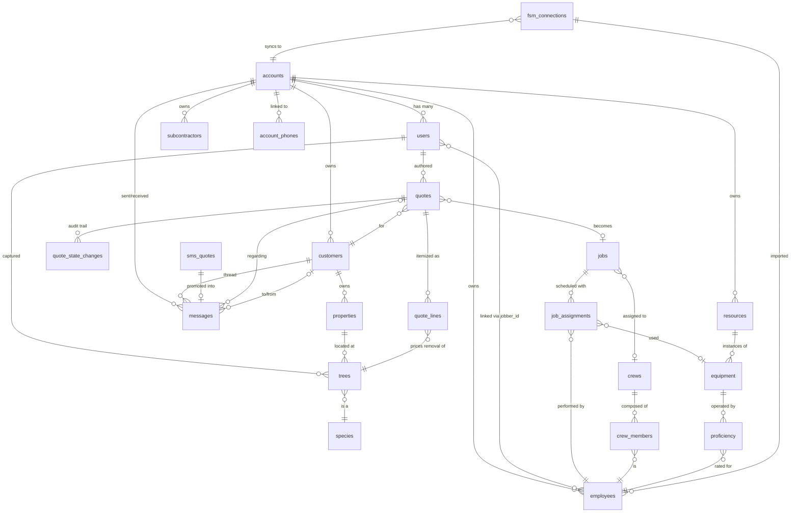

# R8 — Data Architecture for the FMS Vision

> Per `treeq_long_term_vision` memory: TreeQ becomes a basic field-management system (FMS) — saved trees, customers, quotes, scheduling, crews, native SMS+email of quotes. Architect the data model from day one so we don't migrate the schema four times to get there.
>
> This R-doc proposes the entity-relationship model. The actual SQL DDL for the few tables RLS-covered in R5 (`accounts`, `users`, `trees`, `quotes`, `account_phones`, `link_phone_codes`) lives there; this doc is the broader picture.
> Prepared 2026-05-10 overnight session #2.

---

## TL;DR

- **One Postgres database, multi-tenant via `account_id` foreign key on every per-tenant row.** Same pattern R5 already uses for `trees` and `quotes`.
- **Three layers of entities:** identity (accounts, users), customer-facing (customers, properties, trees), operations (quotes, jobs, crews, equipment, messages).
- **The picker is a leaf node, not a hub.** Picker selections produce `tree` records; everything else flows from a `tree`.
- **Quote lifecycle is a state machine, not a free-text field** — `draft → quoted → accepted → scheduled → completed → invoiced → paid`, with a `quote_state_changes` audit table.
- **Messages (SMS + email) are first-class.** A unified `messages` table keyed to `customer_id` + optional `quote_id`. SMS-fallback `sms_quotes` records get promoted into `messages` when the loop closes.
- **R5 RLS pattern extends to all per-tenant tables:** `account_id = public.current_account_id()` on every read/insert/update/delete policy.

---

## ER diagram



---

## Entities (table-by-table)

### Layer 1 — Identity & tenant

#### `accounts`
One row per tree-service company. The unit of multi-tenancy.

| Column | Type | Notes |
|---|---|---|
| id | uuid PK | |
| name | text | e.g., "Spartan Tree & Landscape" |
| market_city | text | drives default location selector + region for ranking |
| default_zip | text | drives SMS-fallback ZIP defaults |
| timezone | text | for scheduling |
| stripe_customer_id | text nullable | ungated until pricing flips |
| created_at | timestamptz | |

#### `users`
Defined in R5 §2. References `auth.users` 1:1 via `id`. Carries `account_id` + `role` ('owner'|'foreman'|'crew').

#### `account_phones` + `link_phone_codes`
Defined in R5 §6. Maps E.164 phone numbers to `account_id` for SMS-fallback.

#### `fsm_connections` (P6+)
OAuth state for Jobber/ServiceTitan/Aspire/ArboStar.

| Column | Type | Notes |
|---|---|---|
| account_id | uuid FK | composite PK with provider |
| provider | text | 'jobber' \| 'servicetitan' \| ... |
| oauth_access_token | text encrypted | |
| oauth_refresh_token | text encrypted | |
| token_expires_at | timestamptz | |
| last_sync_at | timestamptz | |
| sync_status | text | 'ok' \| 'error' \| 'paused' |

### Layer 2 — Customer-facing

#### `customers`
A homeowner or property owner.

| Column | Type | Notes |
|---|---|---|
| id | uuid PK | |
| account_id | uuid FK | |
| name | text | "Jane Homeowner" |
| primary_phone | text | E.164 |
| primary_email | text | |
| jobber_customer_id | text nullable | mirror sync key |
| notes | text | free-form |
| created_at | timestamptz | |

#### `properties`
Customers can own >1 property; trees live on properties.

| Column | Type | Notes |
|---|---|---|
| id | uuid PK | |
| account_id | uuid FK | |
| customer_id | uuid FK | |
| address_line1 | text | |
| address_line2 | text nullable | |
| city, state, zip | text | |
| lat, lng | numeric nullable | one-time geocode |
| created_at | timestamptz | |

#### `species` (read-only catalog, server-managed)
Reference table — the canonical 56-species + future expansion. Either a Postgres table or a static JSON shipped with the worker. **Recommend a Postgres table** so the picker UI can be server-rendered (or fetched via `/api/species`) and so we can add per-account favorites without schema changes.

| Column | Type | Notes |
|---|---|---|
| key | text PK | 'silver_maple' |
| common_name | text | "Silver Maple" |
| latin_name | text | "Acer saccharinum" |
| genus | text | "Acer" |
| group_label | text | "Maples" — the picker's tile label |
| created_at | timestamptz | |

Note: this is *display* metadata only. The calibration coefficients (`b0`, `b1`, `sg`, `moisture`, etc.) live in the worker's `species-db.js`, not in Postgres. That keeps the IP boundary intact.

#### `trees`
Defined in R5 §3.2. References `species(key)`, `properties(id)`. Optional GPS, captured time, computed cuts.

#### `species_favorites`
Per-account favorites list (per ROADMAP F1 P1). Originally localStorage; promoted to server when account exists.

| Column | Type | Notes |
|---|---|---|
| account_id | uuid FK | composite PK with species_key |
| species_key | text FK | |
| favorited_by_user_id | uuid FK | optional — track who added it |
| favorited_at | timestamptz | |

### Layer 3 — Operations (P3+)

#### `quotes`
Defined in R5 §3.3. Carries the full priced-job, status, total. Per-tree itemization lives in `quote_lines`.

#### `quote_lines`
A quote can contain multiple trees. One line = one priced tree.

| Column | Type | Notes |
|---|---|---|
| id | uuid PK | |
| quote_id | uuid FK | composite-indexed with sort_order |
| tree_id | uuid FK | the priced tree (saved in `trees`) |
| line_total_cents | int | server-computed cost |
| line_seconds | int | server-computed crew time |
| sort_order | smallint | display order |
| notes | text | per-tree notes ("over driveway") |

#### `quote_state_changes`
Audit trail. Every state transition gets a row.

| Column | Type | Notes |
|---|---|---|
| id | uuid PK | |
| quote_id | uuid FK | |
| from_state | text | nullable for first state |
| to_state | text | |
| changed_by_user_id | uuid FK | |
| changed_at | timestamptz | |
| notes | text | optional |

#### `jobs`
A scheduled work session. One quote → 0..n jobs (e.g., a multi-tree quote split across 2 days = 2 jobs).

| Column | Type | Notes |
|---|---|---|
| id | uuid PK | |
| account_id | uuid FK | |
| quote_id | uuid FK | one quote can spawn multiple jobs |
| crew_id | uuid FK nullable | which crew |
| scheduled_for | timestamptz | start of work |
| duration_minutes | int | estimated |
| status | text | 'scheduled' \| 'in_progress' \| 'completed' \| 'cancelled' |
| completed_at | timestamptz nullable | |
| notes | text | dispatcher notes |

#### `job_assignments`
Per-employee + per-equipment usage on a job. Drives crew utilization and equipment-wear stats later.

| Column | Type | Notes |
|---|---|---|
| job_id | uuid FK | composite PK with employee_id and resource_key |
| employee_id | uuid FK | |
| resource_key | text | from `resources.resource_key` (per ROADMAP F4) |
| size_key | text nullable | tonnage or working-height bucket |
| hours_estimate | numeric | |
| hours_actual | numeric nullable | |

### Layer 4 — Crew & resource graph (per ROADMAP F4 + F5)

#### `employees`
Per ROADMAP §F5.1. Roles + seniority.

| Column | Type | Notes |
|---|---|---|
| id | uuid PK | |
| account_id | uuid FK | |
| name | text | |
| role | text | 'ground_crew' \| 'foreman' \| 'bucket_operator' \| 'aerial_arborist' |
| seniority | text | 'junior' \| 'regular' \| 'senior' |
| hire_date | date nullable | |
| jobber_employee_id | text nullable | mirror key for Jobber sync |
| user_id | uuid FK nullable | linked TreeQ login if they have one |
| active | boolean | archived not deleted |
| created_at | timestamptz | |

#### `subcontractors`
Per ROADMAP §F5.2. Companies (or individual contract climbers).

| Column | Type | Notes |
|---|---|---|
| id | uuid PK | |
| account_id | uuid FK | |
| name | text | company or individual name |
| service | text | 'crane' \| 'log_truck' \| 'stump' \| 'full_service_stump' \| 'contract_climbing' |
| contact_name | text nullable | |
| contact_phone | text nullable | E.164 |
| default_rate_cents | int nullable | |
| seniority_tier | text nullable | populated only when service = 'contract_climbing' |
| created_at | timestamptz | |

#### `resources`
Per ROADMAP §F4.3. One row per resource type owned by the account, with size matrix.

| Column | Type | Notes |
|---|---|---|
| account_id | uuid FK | composite PK with resource_key |
| resource_key | text | 'mini_skid_steer' \| 'grapple_saw_truck' \| 'bucket_truck' \| ... |
| owned | boolean | |
| size_matrix | jsonb | e.g., `{"40_50": true, "51_60": false}` |
| count_owned | smallint | 0/1/N — most resources are 1 |
| updated_at | timestamptz | |

#### `equipment`
A specific *instance* of a resource (one truck, one specific spider lift). Optional — many tree-service operators won't track per-asset, but the table is here for the day Cameron does. Joins resource_key + size_key + serial.

| Column | Type | Notes |
|---|---|---|
| id | uuid PK | |
| account_id | uuid FK | |
| resource_key | text FK | |
| size_key | text nullable | |
| serial | text nullable | |
| nickname | text nullable | "Big Red" |
| acquired_date | date nullable | |
| status | text | 'active' \| 'in_repair' \| 'retired' |

#### `proficiency`
Per ROADMAP §F4.3. Which employees can run which equipment, at what level.

| Column | Type | Notes |
|---|---|---|
| account_id | uuid FK | |
| employee_id | uuid FK | composite PK with resource_key + size_key |
| resource_key | text FK | |
| size_key | text nullable | |
| level | smallint | 1..10, parallels operator-skill scale |
| updated_at | timestamptz | |

#### `crews`
A reusable team configuration ("Tuesday crew"). Many jobs reference one crew.

| Column | Type | Notes |
|---|---|---|
| id | uuid PK | |
| account_id | uuid FK | |
| name | text | "Crew A" |
| created_at | timestamptz | |

#### `crew_members`
Join.

| Column | Type | Notes |
|---|---|---|
| crew_id | uuid FK | composite PK with employee_id |
| employee_id | uuid FK | |
| role_in_crew | text | "lead climber" / "bucket op" — free text |

### Layer 5 — Communications

#### `messages`
Unified SMS + email log per customer + optional quote.

| Column | Type | Notes |
|---|---|---|
| id | uuid PK | |
| account_id | uuid FK | |
| customer_id | uuid FK nullable | null for anon SMS |
| quote_id | uuid FK nullable | which quote this references |
| channel | text | 'sms_inbound' \| 'sms_outbound' \| 'email_inbound' \| 'email_outbound' |
| from_address | text | E.164 phone or email |
| to_address | text | |
| body | text | |
| sent_at | timestamptz | |
| provider_message_id | text nullable | Quo message id, SendGrid id, etc. |
| status | text | 'queued' \| 'sent' \| 'delivered' \| 'failed' |
| metadata | jsonb | provider-specific blob |

#### `sms_quotes`
The SMS-fallback transient table per `SMS_FALLBACK_SPEC.md` §4. **Promoted into `messages`** when the loop closes (user replies YES or LINK), then carries on as a normal message thread.

| Column | Type | Notes |
|---|---|---|
| id | uuid PK | |
| from_phone | text | E.164 |
| account_id | uuid FK nullable | resolved via account_phones lookup |
| packet | text | raw `TQ#1#...` string |
| parsed_inputs | jsonb | decoded {species, dbh, height, ...} |
| result_price_cents | int | server-computed |
| result_minutes | int | server-computed |
| sent_at | timestamptz | when SMS reply went out |
| conversation_id | text | Quo's thread id |
| status | text | 'pending' \| 'replied' \| 'confirmed' \| 'expired' |
| message_id | uuid FK nullable | links to messages once promoted |

---

## Picker → tree → quote flow

Each picker selection event becomes a single canonical operation:

1. **Picker click** → client builds `{species_key, dbh, trim}` → posts to `/api/estimate` → gets back `{cuts, time, cost}`.
2. **User taps "Save tree"** → POST `/api/trees` with `{species_key, dbh, height, crown, trim, geo?, property_id?}`. Server inserts a row in `trees`.
3. **User adds tree to a quote** → POST `/api/quotes/:id/lines` with `{tree_id, sort_order}`. Server inserts a `quote_lines` row, recomputes total.
4. **Quote sent** → state transitions `draft → quoted`. A `quote_state_changes` audit row is written. SMS or email sent via `messages`.

Mapping picker selection events to entities:
- A picker click that the user **just navigates through** (no save) → no DB write. Only state in the client + the (cached) `/api/estimate` request.
- A picker click that the user **does save** → one `trees` row.
- A picker click that the user **adds to an open quote** → one `trees` row + one `quote_lines` row.

---

## RLS extension to all per-tenant tables

R5 §3 covers `trees`, `quotes`, `account_phones`, `link_phone_codes`. Every other per-tenant table follows the same template:

```sql
alter table public.<table> enable row level security;

create policy <table>_select_own_account
  on public.<table> for select to authenticated
  using (account_id = public.current_account_id());

create policy <table>_insert_own_account
  on public.<table> for insert to authenticated
  with check (account_id = public.current_account_id());

create policy <table>_update_own_account
  on public.<table> for update to authenticated
  using (account_id = public.current_account_id())
  with check (account_id = public.current_account_id());

create policy <table>_delete_own_account
  on public.<table> for delete to authenticated
  using (account_id = public.current_account_id());

create index <table>_account_id_idx on public.<table>(account_id);
```

**Reference catalogs** (`species`) get read-only RLS for all authenticated users with no `account_id` check:

```sql
alter table public.species enable row level security;
create policy species_select_all
  on public.species for select to authenticated using (true);
-- inserts and updates only via service-role key (admin operations)
```

`messages` and `sms_quotes` are operational tables that the SMS handler writes via the service role key — they don't need user-level insert policies, only select policies for the account owner to read them back.

---

## Indexing checklist

For every per-tenant table:
- Index on `account_id` (selected on every query)
- Index on any FK referenced by joins (`customer_id`, `tree_id`, `quote_id`)
- Index on `created_at` desc for "recent" queries
- For `messages`: composite index on `(account_id, customer_id, sent_at desc)` for thread display
- For `sms_quotes`: index on `from_phone` for the webhook-handler lookup

---

## Migration order (when actually building)

1. **P2** — `accounts`, `users`, `account_phones`, `link_phone_codes`. (Auth ships.)
2. **P3** — `species` catalog + `species_favorites` + `trees`. (Saved trees ship.)
3. **P4** — `resources`, `equipment`. (Resource pages ship.)
4. **P5** — `employees`, `subcontractors`, `crews`, `crew_members`, `proficiency`. (Team management ships.)
5. **P6** — `fsm_connections` + Jobber-specific syncs into `employees`, `customers`. (Jobber integration ships.)
6. **P7** — `customers`, `properties`, `quotes`, `quote_lines`, `quote_state_changes`, `messages`, `jobs`, `job_assignments`. (Pricing engine v1 + first quote-to-job loop ships.)
7. **SMS-* (alongside P3)** — `sms_quotes` lands when SMS-1/2/3 ship; this can predate the full `customers`+`properties` graph.

The data model is designed so each phase adds tables without backfill on prior phases.

---

## Cross-references

- R5 §2 — accounts/users SQL + `current_account_id()` helper
- R5 §3 — trees + quotes RLS samples
- R5 §6 — account_phones flow
- R7 — `/api/estimate` is the read-side of `species`+coefficients (kept on worker, not in Postgres)
- R10 (forthcoming) — system architecture diagram tying these tables to the worker + client + Quo
- ROADMAP F1–F7 — the product features each table supports
- SMS_FALLBACK_SPEC §4 — `sms_quotes` row shape

---

## Open questions for Cameron

1. **`stripe_customer_id` on `accounts` from day one or only when monetizing flips?** Recommend day one — empty column is harmless, schema migration later is annoying.
2. **`equipment` per-asset tracking — required or optional?** Most operators don't track. Recommend the table exists but is empty until P4 ships and Cameron decides whether to populate it.
3. **`messages` channel split — separate tables for SMS vs email or unified?** Recommend unified per above. The `channel` column distinguishes; the body shape is the same.
4. **`customers` privacy — per ROADMAP open Q3, GPS coordinates on saved trees: precise lat/lng vs zip-only?** Recommend storing precise lat/lng but exposing only zip-level to non-owner roles via a `view`. Field staff need precise coords for navigation; analytics doesn't.
5. **Multi-market pricing data** — per ROADMAP open Q4, when a user sets market = Charlotte, do we need market-specific calibration coefficients in `species`? Recommend: not at the table level. Calibration stays single-region (Rochester) until field data justifies a fork; market only drives ranking + display, not math.
